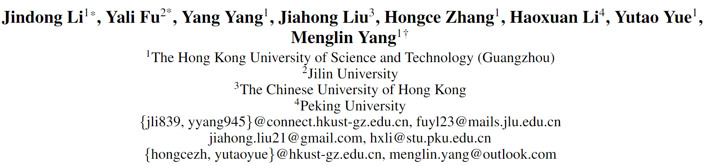
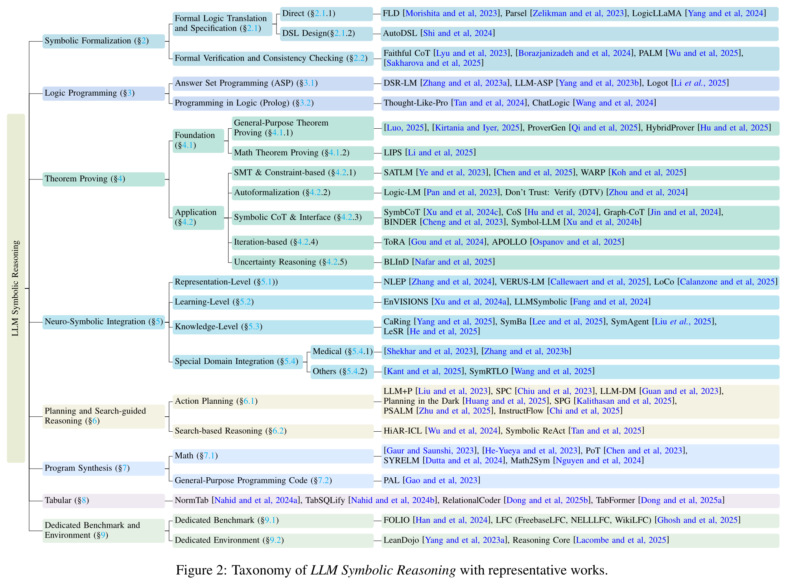
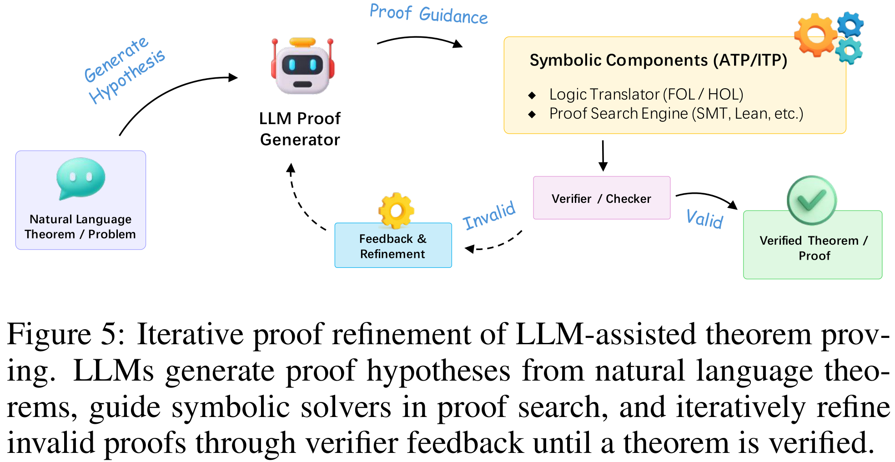

<div align="center">
    <h1><b>A Survey on LLM Symbolic Reasoning</b></h1>
</div>

The official GitHub page for the survey paper "A Survey on LLM Symbolic Reasoning". And this survey has been accepted by AAAI 2026 Bridge--Logical and Symbolic Reasoning in Language Models.

<div align="center">


<a href="https://arxiv.org/" target="_blank"></a>

</div>


History Version: [[TechRxiv]](https://www.techrxiv.org/users/1002499/articles/1367055-a-survey-on-llm-symbolic-reasoning)

<br>


<p align="center">
    
</p>
<br>
<br>


<p align="center">
    
</p>
<br>


<p align="center">
    
</p>
<br>


## 2. Theorem Proving (TP)

### 2.1 ATP (Automated Theorem Proving)

#### 2.1.1 Direct

1. 2025_arXiv_Reinforced Large Language Model is A Formal Theorem Prover.
   
   [[arXiv]](https://arxiv.org/abs/2502.08908)
   [[GitHub]](https://github.com/zhilingluo/theorem_prover)

2. 2025_arXiv_Steering LLMs for Formal Theorem Proving.

   [[arXiv]](https://arxiv.org/abs/2502.15507)

3. 2024_Nature_AlphaGeometry_Solving Olympiad Geometry without Human Demonstrations.

   [[Nature]](https://www.nature.com/articles/s41586-023-06747-5)
   [[GitHub]](https://github.com/google-deepmind/alphageometry)

4. 2025_ICLR_LIPS_Proving Olympiad Inequalities by Synergizing LLMs and Symbolic Reasoning.

   [[ICLR]](https://openreview.net/forum?id=FiyS0ecSm0)
   [[GitHub]](https://github.com/Lizn-zn/NeqLIPS)

5. 2025_arXiv_HybridProver_HybridProver= Augmenting Theorem Proving with LLM-Driven Proof Synthesis and Refinement.

   [[arXiv]](https://arxiv.org/abs/2505.15740)


#### 2.1.2 Decomposed

1. 2025_Nature_AlphaProof_Olympial-Level Formal Mathematical Reasoning with Reinforcement Learning.

   [[Nature]](https://www.nature.com/articles/s41586-025-09833-y)

2. 2025_arXiv_APOLLO_APOLLO: Automated LLM and Lean Collaboration for Advanced Formal Reasoning.

   [[arXiv]](https://arxiv.org/abs/2505.05758)
   [[GitHub]](https://github.com/aziksh-ospanov/APOLLO)

3. 2025_EMNLP_DREAM_Towards Advanced Mathematical Reasoning for LLMs via First-Order Logic Theorem Proving.

   [[EMNLP]](https://aclanthology.org/2025.emnlp-main.628/)

4. 2025_arXiv_DeepSeek-Porver-V2_DeepSeek-Porver-V2: Advancing Formal Mathematical Reasoning via Reinforcement Learning for Subgoal Decomposition.

   [[arXiv]](https://arxiv.org/abs/2504.21801)


### 2.2 ITP (Interactive Theorem Proving)

1. 2024_arXiv_Lean Copilot_Lean Copilot= Large Language Models as Copilots for Theorem Proving in Lean.

   [[arXiv]](https://arxiv.org/abs/2404.12534)

2. 2024_EMNLP_BC-Prover_BC-Prover: Backward Chaining Prover for Formal Theorem Proving.

   [[EMNLP]](https://aclanthology.org/2024.emnlp-main.180/)


## 3. Satisfiability Solving (SAT)

### 3.1 Logical Inference Verification

1. 2023_EMNLP_LINC_LINC: A Neurosymbolic Approach for Logical Reasoning by Combining Language Models with First-Order Logic Provers.

   [[EMNLP]](https://aclanthology.org/2023.emnlp-main.313/)
   [[arXiv]](https://arxiv.org/abs/2305.12295)
   [[GitHub]](https://github.com/teacherpeterpan/Logic-LLM)

2. 2023_EMNLP_Logic-LM_Logic-LM: Empowering Large Language Models with Symbolic Solvers for Faithful Logical Reasoning

    [[EMNLP]](https://aclanthology.org/2023.findings-emnlp.248/)
    [[arXiv]](https://arxiv.org/abs/2305.12295)
    [[GitHub]](https://github.com/teacherpeterpan/Logic-LLM)

3. 2024_ICLR_DTV_Don't Trust: Verify-Grounding LLM Quantitative Reasoning with Autoformalization.

    [[ICLR]](https://proceedings.iclr.cc/paper_files/paper/2024/hash/0a79ecda13603817de4cdfc68b417e89-Abstract-Conference.html)
    [[arXiv]](https://arxiv.org/abs/2403.18120)
    [[GitHub]](https://github.com/jinpz/dtv)

4. 2024_NeurIPS_ALT_Enhancing Reasoning Capabilities of LLMs via Principled Synthetic Logic Corpus.

   [[NeruIPS]](https://proceedings.neurips.cc/paper_files/paper/2024/hash/8678da90126aa58326b2fc0254b33a8c-Abstract-Conference.html)
   [[arXiv]](https://arxiv.org/abs/2411.12498)

5. 2025_ICLR_CLOVER_Divide and Translate= Compositional First-Order Lgoic Translation and Verification for Complex Logical Reasoning.

    [[ICLR]](https://proceedings.iclr.cc/paper_files/paper/2025/hash/3e592c571de69a43d7a870ea89c7e33a-Abstract-Conference.html)
    [[OpenReview]](https://openreview.net/forum?id=09FiNmvNMw)
    [[arXiv]](https://arxiv.org/abs/2410.08047)

6. 2025_ACL_Aristotle_Aristotle=Mastering Logical Reasoning with A LogicComplete Decompose-Search-Resolve Framework.

    [[ACL]](https://aclanthology.org/2025.acl-long.153/)


### 3.2 Compound Constraint Solving

1. 2023_NeurIPS_SATLM_SATLM: Satisfiability-Aided Language Models Using Declarative Prompting.

    [[NeurIPS]](https://proceedings.neurips.cc/paper_files/paper/2023/hash/8e9c7d4a48bdac81a58f983a64aaf42b-Abstract-Conference.html)
    [[arXiv]](https://arxiv.org/abs/2305.09656)
    [[GitHub]](https://github.com/xiye17/SAT-LM)

2. 2025_NeurlPS_HAR&CoPA_Bootstrapping Hierarchical Autoregressive Formal Reasoner with Chain-of-Proxy-Autoformalization.

    [[NeruIPS]](https://neurips.cc/virtual/2025/loc/san-diego/poster/120138)
    [[GitHub]](https://github.com/Purewhite2019/har_copa_main)

3. 2025_arXiv_Loop-Invariant-Generation_Loop-Invariant-Generation: A Hybrid Fraemwork of Reasoning Optimised LLMs and SMT Solvers.

    [[arXiv]](https://arxiv.org/abs/2508.00419)


## 4. Consistency Checking

### 4.1 Internal Self-Consistency

1. 2021_EMNLP_BeliefBank_BeliefBank: Adding Memory to a Pre-Trained Language Model for a Systematic Notion of Belief.

    [[EMNLP]](https://aclanthology.org/2021.emnlp-main.697/)
    [[arXiv]](https://arxiv.org/abs/2109.14723)

2. 2022_EMNLP_ConCoRD_Enhancing Self-Consistency and Performance of Pre-Trained Language Models through Natural Language Inference.

    [[EMNLP]](https://aclanthology.org/2022.emnlp-main.115/)

3. 2022_EMNLP_Maieutic Prompting_Maieutic Prompting: Logically Consistent Reasoning with Recursive Explanations.

    [[EMNLP]](https://aclanthology.org/2022.emnlp-main.82/)
    [[arXiv]](https://arxiv.org/abs/2205.11822)

4. 2025_ICML_REPAIR_Aligning with Logic= Measuring, Evaluating and Improving Logical Preference Consistency in Large Language Models.

    [[ICML]](https://proceedings.mlr.press/v267/liu25u.html)


### 4.2 External Knowledge Consistency

1. 2023_EMNLP_REFLEX_Language Models with Rationality.

    [[EMNLP]](https://aclanthology.org/2023.emnlp-main.877/)
    [[OpenReview]](https://openreview.net/forum?id=6j7JZnEzf4)
    [[arXiv]](https://arxiv.org/abs/2305.14250)

2. 2025_ICLR_LoCo-LMs_Logically Consistent Language Models via Neuro-Symbolic Integration.

    [[OpenReview]](https://openreview.net/forum?id=7PGluppo4k)
    [[arXiv]](https://arxiv.org/abs/2409.13724)
    [[GitHUb]](https://github.com/ddidacus/loco-llm)

3. 2025_ICLR_LLMQuery_Logical Consistency of Large Language Models in Fact-Checking.

    [[OpenReview]]()
    [[arXiv]](https://arxiv.org/abs/2412.16100)


## 5. Planning and Searching

### 5.1 Planning for Actions

#### 5.1.1 Ungrounded

1. 2023_arXiv_LLM+P_LLM+P: Empowering Large Language Models with Optimal Planning Proficiency.

    [[arXiv]](https://arxiv.org/abs/2304.11477)
    [[GitHub]](https://github.com/Cranial-XIX/llm-pddl)

2. 2023_NeurIPS_LLM-DM_Leveraging Pre-trained Large Language Models to Construct and Utilize World Models for Model-based Task Planning.

    [[NeurIPS]](https://proceedings.neurips.cc/paper_files/paper/2023/hash/f9f54762cbb4fe4dbffdd4f792c31221-Abstract-Conference.html)
    [[GitHub]](https://guansuns.github.io/pages/llm-dm/)

3. 2025_AAAI_Planning in the Dark: LLM-Symbolic Planning Pipeline Without Experts.

    [[AAAI]](https://ojs.aaai.org/index.php/AAAI/article/view/34855)
    [[GitHub]](https://github.com/Sino-Huang/Official-LLM-Symbolic-Planning-without-Experts)

4. 2025_NAACL_PSALM_Language Models Can Infer Action Semantics for Symbolic Planners from Environment Feedback.

    [[NAACL]](https://aclanthology.org/2025.naacl-long.440/)


#### 5.1.2 Grounded

1. 2025_ICML workshop_SPG_Sketch-Plan-Generalize= Learning and Planning with Neuro-Symbolic Programmatic Representations for Inductive Spatial Concepts.

    [[OpenReview]](https://openreview.net/forum?id=pTOQwAQ14h)
    [[arXiv]](https://arxiv.org/abs/2404.07774)

2. 2025_NeurIPS_InstructFlow_InstructFlow: Adaptive Symbolic Constraint-Guided Code Generation for Long-Horizon Planning.

    [[OpenReview]](https://openreview.net/forum?id=nzwjvpCO4F)


### 5.2 (MCTS-based) Searching for Reasoning Path

1. 2024_arXiv_HiAR-ICL_Beyond Examples: High-level Automated Reasoning Paradigm in In-Context Learning via MCTS.

    [[arXiv]](https://arxiv.org/abs/2411.18478)
    [[GitHub]](https://jinyangwu.github.io/hiar-icl/)

2. 2025_EMNLP_Symbolic ReAct_Enhancing Logical Reasoning in Language Models via Symbolically-Guided Monte Carlo Process Supervision.

    [[EMNLP]](https://aclanthology.org/2025.emnlp-main.1624/)
    [[arXiv]](https://arxiv.org/abs/2505.20415)


## 6. Normalized Tabular Reasoning

### 6.1 Question Answering (QA)

1. 2024_EMNLP_NormTab_NormTab: Improving Symbolic Reasoning in LLMs Through Tabular Data Normalization.

    [[EMNLP]](https://aclanthology.org/2024.findings-emnlp.203/)
    [[arXiv]](https://arxiv.org/abs/2406.17961)
    [[GitHub]](https://github.com/mahadi-nahid/NormTab)

2. 2024_NAACL_TabSQLify_TabSQLify: Enhancing Reasoning Capabilities of LLMs Through Table Decomposition.
    [[NAACL]](https://aclanthology.org/2024.naacl-long.320/)
    [[arXiv]](https://arxiv.org/abs/2404.10150)
    [[GitHub]](https://github.com/mahadi-nahid/TabSQLify)

3. 2025_ACL_RelationalCoder_RelationalCoder: Rethinking Complex Tables via Programmatic Relational Transformation.

    [[ACL]](https://aclanthology.org/2025.acl-long.89/)
    [[GitHub]](https://github.com/haoyudong/RelationalCoder)

4. 2025_SIGIR_TabFormer_Reasoning and Retrieval for Complex Semi-structured Tables via Reinforced Relational Data Transformation.

    [[SIGIR]](https://dl.acm.org/doi/10.1145/3726302.3730071)

5. 2025_NAACL_H-STAR_H-STAR: LLM-driven Hybrid SQL-Text Adaptive Reasoning on Tables.

    [[NAACL]](https://aclanthology.org/2025.naacl-long.445/)


### 6.2 Fact Verification

1. 2024_TACL_TabVer_TabVer= Tabular Fact Verification with Natural Logic.

    [[TACL]](https://aclanthology.org/2024.tacl-1.89/)

2. 2025_ICLR_TIDE_Triples as the Key: Structuring Makes Decomposition and Verification Easier in LLM-based TableQA.

    [[OpenReview]](https://openreview.net/forum?id=UwcZEoNP19)

3. 2025_SIGIR_TabFormer_Reasoning and Retrieval for Complex Semi-structured Tables via Reinforced Relational Data Transformation.

    [[SIGIR]](https://dl.acm.org/doi/10.1145/3726302.3730071)


### 6.3 Temporal Reasoning 

1. 2025_arXiv_LLM-Symbolic_LLM-Symbolic Integration for Robust Temporal Tabular Reasoning.

    [[arXiv]](https://arxiv.org/abs/2506.05746)

2. 2025_arXiv_Evidence-Guided-Schema-Normalization-for-Temporal-Tabular-Reasoning.

    [[arXiv]](https://arxiv.org/abs/2512.00329)


## 7. Real-World Applications

### 7.1 Medical 

1. 2023_arXiv_Coupling Symbolic Reasoning with Language Modeling for Efficient Longitudinal Understanding of Unstructured Electronic Medical Records.

    [[arXiv]](https://arxiv.org/abs/2308.03360)

2. 2023_BIBM_Integrating Automated Knowledge Extraction with Large Language Models for Explainable Medical Decision-Making.

    [[IEEE]](https://ieeexplore.ieee.org/document/10385557)

3. 


### 7.2 Law (Legal Reasoning)


### 7.3 LLM Safety (Attack and Defense)


### 7.4 Hardware Design


### 7.5 Program Analysis


<!--

## 2. Symbolic Formalization

<p align="center">
    
</p>

### 2.1 Formal Logic Translation and Specification
#### 2.1.1 Direct

1. 2023_ICML_FLD_Learning Deductive Reasoning from Synthetic Corpus based on Formal Logic.
   [[ICML]](https://proceedings.mlr.press/v202/morishita23a.html)
   [[GitHub]](https://github.com/hitachi-nlp/FLD)

2. 2023_NeurIPS_Parsel_Parsel: Algorithmic Reasoning with Language Models by Composing Decompositions.
   [[NeurlPS]](https://proceedings.neurips.cc/paper_files/paper/2023/hash/6445dd88ebb9a6a3afa0b126ad87fe41-Abstract-Conference.html)
   [[GitHub]](https://github.com/ezelikman/parsel)
   [[Homepage]](http://zelikman.me/parselpaper/)

3. 2024_ACL_LogicLLaMA_Harnessing the Power of Large Language Models for Natural Language to First-Order Logic Translation.
   [[ACL]](https://aclanthology.org/2024.acl-long.375/)
   [[GitHub]](https://github.com/gblackout/LogicLLaMA)
   

#### 2.1.2 DSL Design

1. 2024_ACL_AutoDSL_AutoDSL: Automated Domain-Specific Language Design for Structural Representation of Procedures with Constraints.
   [[ACL]](https://aclanthology.org/2024.acl-long.659/)


### 2.2 Formal Verification and Consistency Checking

1. 2023_IJCNLP-AACL_Faithful CoT_Faithful Chain-of-Thought Reasoning.
   [[IJCNLP-AACL]](https://aclanthology.org/2023.ijcnlp-main.20/)
   [[GitHub]](https://github.com/veronica320/Faithful-COT)

2. 2024_arXiv_Reliable Reasoning Beyond Natural Language.
   [[arXiv]](https://arxiv.org/abs/2407.11373)
   [[GitHub]](https://github.com/NasimBorazjani/Reasoning-Beyond-NL)

3. 2025_arXiv_PALM_Generating and Understanding Tests via Path-Aware Symbolic Execution with LLMs.
   [[arXiv]](https://arxiv.org/abs/2506.19287)

4. 2025_NAACL workshop_Integrating Symbolic Execution into the Fine-Tuning of Code-Generating LLMs.
   [[NAACL workshop]](https://aclanthology.org/2025.naacl-srw.27/)


## 3. Logic Programming

<p align="center">
    
</p>

### 3.1 Answer Set Programming (ASP)

1. 2023_ACL_DSR-LM_Improved Logical Reasoning of Language Models via Differentiable Symbolic Programming.
   [[ACL]](https://aclanthology.org/2023.findings-acl.191/)
   [[GitHub]](https://github.com/moqingyan/dsr-lm)

2. 2023_ACL_LLM-ASP_Coupling Large Language Models with Logic Programming for Robust and General Reasoning from Text.
   [[ACL]](https://aclanthology.org/2023.findings-acl.321/)
   [[GitHub]](https://github.com/azreasoners/LLM-ASP)

3. 2025_arXiv_Logot_Logic-of-Thought_Logic-of-Thought: Empowering Large Language Models with Logic Programs for Solving Puzzles in Natural Language.
   [[arXiv]](https://arxiv.org/abs/2505.16114)
   [[GitHub]](https://github.com/naiqili/Logic-of-Thought)


### 3.2 Programming in Logic (Prolog)

1. 2024_arXiv_Thought-Like-Pro_Thought-Like-Pro: Enhancing Reasoning of Large Language Models through Self-Driven Prolog-based Chain-of-Thought.
   [[arXiv]](https://arxiv.org/abs/2407.14562)

2. 2024_IJCNN_ChatLogic_ChatLogic: Integrating Logic Programming with Large Language Models for Multi-Step Reasoning.
   [[IJCNN]](https://ieeexplore.ieee.org/abstract/document/10650138)
   [[GitHub]](https://github.com/Strong-AI-Lab/ChatLogic)


## 4. Theorem Proving

<p align="center">
    
</p>

### 4.1 Foundation
#### 4.1.1 General-Purpose Theorem Proving

1. 2025_arXiv_Reinforced Large Language Model is A Formal Theorem Prover.
   [[arXiv]](https://arxiv.org/abs/2502.08908)
   [[GitHub]](https://github.com/zhilingluo/theorem_prover)

2. 2025_arXiv_Steering LLMs for Formal Theorem Proving.
   [[arXiv]](https://arxiv.org/abs/2502.15507)

3. 2025_arXiv_HybridProver_HybridProver= Augmenting Theorem Proving with LLM-Driven Proof Synthesis and Refinement.
   [[arXiv]](https://arxiv.org/abs/2505.15740)

4. 2025_ICLR_ProverGen_Large Language Models Meet Symbolic Provers for Logical Reasoning Evaluation.
   [[ICLR]](https://openreview.net/forum?id=C25SgeXWjE)
   [[GitHub]](https://github.com/opendatalab/ProverGen)


#### 4.1.2 Math Theorem Proving

1. 2024_Nature_AlphaGeometry_Solving Olympiad Geometry without Human Demonstrations.
   [[Nature]](https://www.nature.com/articles/s41586-023-06747-5)
   [[GitHub]](https://github.com/google-deepmind/alphageometry)

2. 2025_ICLR_LIPS_Proving Olympiad Inequalities by Synergizing LLMs and Symbolic Reasoning.
   [[ICLR]](https://openreview.net/forum?id=FiyS0ecSm0)
   [[GitHub]](https://github.com/Lizn-zn/NeqLIPS)


### 4.2 Application
#### 4.2.1 SMT & Constraint-based Reasoning

1. 2023_NeurIPS_SATLM_SATLM= Satisfiability-Aided Language Models Using Declarative Prompting.
   [[NeurIPS]](https://proceedings.neurips.cc/paper_files/paper/2023/hash/8e9c7d4a48bdac81a58f983a64aaf42b-Abstract-Conference.html)
   [[GitHub]](https://github.com/xiye17/SAT-LM)

2. 2025_arXiv_LLM-based Satisfiability Checking of String Requirements by Consistent Data and Chekcer Generation.
   [[arXiv]](https://arxiv.org/abs/2506.16639)

3. 2025_arXiv_WARP_Worst-Case Symbolic Constraints Analysis and Generalisation with Large Language Models.
   [[arXiv]](https://arxiv.org/abs/2506.08171)


#### 4.2.2 Autoformalization

1. 2023_EMNLP_Logic-LM_Logic-LM: Empowering Large Language Models with Symbolic Solvers for Faithful Logical Reasoning.
   [[EMNLP]](https://aclanthology.org/2023.findings-emnlp.248/)
   [[GitHub]](https://github.com/teacherpeterpan/Logic-LLM)

2. 2024_ICLR_DTV_Don't Trust: Verify-Grounding LLM Quantitative Reasoning with Autoformalization.
   [[ICLR]](https://openreview.net/forum?id=V5tdi14ple)
   [[GitHub]](https://github.com/jinpz/dtv)

3. 2025_NeurlPS_HAR&CoPA_Bootstrapping Hierarchical Autoregressive Formal Reasoner with Chain-of-Proxy-Autoformalization.
   [[NeurlPS]](https://openreview.net/forum?id=2Xn8h68mP3)
   [[GitHub]](https://github.com/Purewhite2019/har_copa_main)


#### 4.2.3 Symbolic CoT & Interfaces

1. 2023_ICLR_BINDER_Binding Language Models in Symbolic Languages.
   [[ICLR]](https://openreview.net/forum?id=lH1PV42cbF)
   [[Homepage]](https://lm-code-binder.github.io/)
   [[GitHub]](https://github.com/xlang-ai/Binder)

2. 2024_ACL_Graph-CoT_Graph Chain-of-Thought: Augmenting Large Language Models by Reasoning on Graphs.
   [[ACL]](https://aclanthology.org/2024.findings-acl.11/)
   [[GitHub]](https://github.com/PeterGriffinJin/Graph-CoT)

3. 2024_ACL_SymbCoT_Faithful Logical Reasoning via Symbolic Chain-of-Thought.
   [[ACL]](https://aclanthology.org/2024.acl-long.720/)
   [[GitHub]](https://github.com/Aiden0526/SymbCoT)

4. 2024_ACL_Symbol-LLM_Symbol-LLM: Towards Foundational Symbol-centric Interface For Large Language Models.
   [[ACL]](https://aclanthology.org/2024.acl-long.707/)
   [[Homepage]](https://xufangzhi.github.io/symbol-llm-page/)
   [[GitHub]](https://github.com/xufangzhi/Symbol-LLM)
   
5. 2024_COLM_CoS_Chain-of-Symbol Prompting for Spatial Reasoning in Large Language Models.
   [[COLM]](https://openreview.net/forum?id=Hvq9RtSoHG)
   [[GitHub]](https://github.com/hanxuhu/chain-of-symbol-planning)


#### 4.2.4 Iteration-based Reasoning

1. 2024_ICLR_ToRA_ToRA: A Tool-Integrated Reasoning Agent for Mathematical Problem Solving.
   [[ICLR]](https://openreview.net/forum?id=Ep0TtjVoap)
   [[GitHub]](https://github.com/microsoft/ToRA)

2. 2025_arXiv_APOLLO_APOLLO: Automated LLM and Lean Collaboration for Advanced Formal Reasoning.
   [[arXiv]](https://arxiv.org/abs/2505.05758)
   [[GitHub]](https://github.com/aziksh-ospanov/APOLLO)


#### 4.2.5 Uncertainty Reasoning

1. 2025_AAAI_BLInD_Reasoning over Uncertain Text by Generative Large Language Models.
   [[AAAI]](https://ojs.aaai.org/index.php/AAAI/article/view/34674)
   [[GitHub]](https://github.com/HLR/BLInD)


## 5. Neuro-Symbolic Integration

<p align="center">
    
</p>


### 5.1 Representation-Level

1. 2024_NAACL_NLEP_Natural Language Embedded Programs for Hybrid Language Symbolic Reasoning.
   [[NAACL]](https://aclanthology.org/2024.findings-naacl.259/)
   [[GitHub]](https://github.com/luohongyin/LangCode)

2. 2025_arXiv_VERUS-LM_VERUS-LM: a Versatile Framework for Combining LLMs with Symbolic Reasoning.
   [[arXiv]](https://arxiv.org/abs/2501.14540)
   [[GitHub]](https://gitlab.com/EAVISE/bca/verus-lm)
   
3. 2025_ICLR_LoCo_Logically Consistent Language Models via Neuro-Symbolic Integration.
   [[ICLR]](https://openreview.net/forum?id=7PGluppo4k)
   [[GitHub]](https://github.com/ddidacus/loco-llm)


### 5.2 Learning-Level

1. 2024_arXiv_ENVISIONS_Interactive Evolution: A Neural-Symbolic Self-Training Framework For Large Language Models.
   [[arXiv]](https://arxiv.org/abs/2406.11736)
   [[GitHub]](https://github.com/xufangzhi/ENVISIONS)

2. 2024_AAAI_LLMSymbolic_Large language models are neurosymbolic reasoners.
   [[AAAI]](https://ojs.aaai.org/index.php/AAAI/article/view/29754)
   [[GitHub]](https://github.com/hyintell/LLMSymbolic)


### 5.3 Knowledge-Level

1. 2025_arXiv_LeSR_Large Language Model-Enhanced Symbolic Reasoning for Knowledge Base Completion.
   [[arXiv]](https://arxiv.org/abs/2501.01246)

2. 2025_NAACL_CaRing_Neuro-Symbolic Integration Brings Causal and Reliable Reasoning Proofs.
   [[NAACL]](https://aclanthology.org/2025.findings-naacl.317/)
   [[GitHub]](https://github.com/DAMO-NLP-SG/CaRing)

3. 2025_NAACL_SymBa_SymBa: Symbolic Backward Chaining for Structured Natural Language Reasoning.
   [[NAACL]](https://aclanthology.org/2025.naacl-long.124/)
   [[GitHub]](https://github.com/lbox-kr/symba)

4. 2025_WWW_SymAgent_SymAgent: A Neural-Symbolic Self-Learning Agent Framework for Complex Reasoning over Knowledge Graphs.
   [[WWW]](https://dl.acm.org/doi/abs/10.1145/3696410.3714768)


### 5.4 Special Domain Integration
#### 5.4.1 Medical

1. 2023_arXiv_Coupling Symbolic Reasoning with Language Modeling for Efficient Longitudinal Understanding of Unstructured Electronic Medical Records.
   [[arXiv]](https://arxiv.org/abs/2308.03360)

2. 2023_BIBM_Integrating Automated Knowledge Extraction with Large Language Models for Explainable Medical Decision-Making.
   [[BIBM]](https://ieeexplore.ieee.org/abstract/document/10385557/)


#### 5.4.2 Others

1. 2025_arXiv_Towards Robust Legal Reasoning: Harnessing Logical LLMs in Law.
   [[arXiv]](https://arxiv.org/abs/2502.17638)
   
2. 2025_NeurIPS_SymRTLO_SymRTLO: Enhancing RTL Code Optimization with LLMs and Neuron-Inspired Symbolic Reasoning.
   [[arXiv]](https://arxiv.org/abs/2504.10369)


## 6. Planning and Search-guided Reasoning

<p align="center">
    
</p>

### 6.1 Action Planning

1. 2023_arXiv_LLM+P_LLM+P: Empowering Large Language Models with Optimal Planning Proficiency. 
   [[arXiv]](https://arxiv.org/abs/2304.11477)
   [[GitHub]](https://github.com/Cranial-XIX/llm-pddl)

2. 2023_EMNLP_SPC_Symbolic Planning and Code Generation for Grounded Dialogue.
   [[EMNLP]](https://aclanthology.org/2023.emnlp-main.460/)

3. 2023_NeurIPS_LLM-DM_Leveraging Pre-trained Large Language Models to Construct and Utilize World Models for Model-based Task Planning.
   [[NeurIPS]](https://proceedings.neurips.cc/paper_files/paper/2023/hash/f9f54762cbb4fe4dbffdd4f792c31221-Abstract-Conference.html)
   [[GitHub]](https://guansuns.github.io/pages/llm-dm/)

4. 2025_AAAI_Planning in the Dark: LLM-Symbolic Planning Pipeline Without Experts.
   [[AAAI]](https://ojs.aaai.org/index.php/AAAI/article/view/34855)
   [[GitHub]](https://github.com/Sino-Huang/Official-LLM-Symbolic-Planning-without-Experts)

5. 2025_ICML workshop_SPG_Sketch-Plan-Generalize: Learning and Planning with Neuro-Symbolic Programmatic Representations for Inductive Spatial Concepts.
   [[ICML workshop]](https://openreview.net/forum?id=pTOQwAQ14h)
   [[arXiv]](https://arxiv.org/abs/2404.07774)

6. 2025_NAACL_PSALM_Language Models Can Infer Action Semantics for Symbolic Planners from Environment Feedback.
   [[NAACL]](https://aclanthology.org/2025.naacl-long.440/)

7. 2025_NeurIPS_InstructFlow_InstructFlow: Adaptive Symbolic Constraint-Guided Code Generation for Long-Horizon Planning.
   [[ICML wrkshop]](https://openreview.net/forum?id=wr47LsSUjH&noteId=wr47LsSUjH)
   [[NeurlPS]](https://openreview.net/forum?id=nzwjvpCO4F)


### 6.2 Search-based Reasoning

1. 2024_arXiv_HiAR-ICL_Beyond Examples: High-level Automated Reasoning Paradigm in In-Context Learning via MCTS.
   [[arXiv]](https://arxiv.org/abs/2411.18478)
   [[Homepage]](https://jinyangwu.github.io/hiar-icl/)
   [[GitHub]](https://github.com/jinyangwu/HiARICL)

2. 2025_arXiv_Symbolic ReAct_Enhancing Logical Reasoning in Language Models via Symbolically-Guided Monte Carlo Process Supervision.
   [[arXiv]](https://arxiv.org/abs/2505.20415)


## 7. Program Synthesis
### 7.1 Math

1. 2023_ACL_Reasoning in Large Language Models Through Symbolic Math Word Problems.
   [[ACL]](https://aclanthology.org/2023.findings-acl.364/)
   [[GitHub]](https://github.com/vedantgaur/Symbolic-MWP-Reasoning)

2. 2023_NeurIPS workshop_Solving Math Word Problems by Combining Language Models With Symbolic Solvers.
   [[NeurIPS workshop]](https://openreview.net/forum?id=m7m14acWQi)
   [[arXiv]](https://arxiv.org/abs/2304.09102)
   [[GitHub]](https://github.com/joyheyueya/declarative-math-word-problem)

3. 2023_TMLR_PoT_Program of Thougths Prompting: Disentangling Computation from Reasoning for Numerical Reasoning Tasks.
   [[TMLR]](https://openreview.net/forum?id=YfZ4ZPt8zd)
   [[GitHub]](https://github.com/TIGER-AI-Lab/Program-of-Thoughts)

4. 2024_AAAI_SYRELM_Frugal LMs Trained to Invoke Symbolic Solvers Achieve Parameter-Efficient Arithmetic Reasoning.
   [[AAAI]](https://ojs.aaai.org/index.php/AAAI/article/view/29750)
   [[GitHub]](https://github.com/joykirat18/SYRELM)

5. 2024_NeurIPS Workshop_Math2Sym_Math2Sym: A System for Solving Elementary Problems via Large Language Mdoels and Symbolic Solvers.
   [[NeurIPS Workshop]](https://openreview.net/forum?id=eQrkAPcGRF&noteId=eQrkAPcGRF)
   [[GitHub]](https://github.com/pepoo20/Math2Sym)


### 7.2 General-Purpose Programming Code

1. 2023_ICML_PAL_PAL: Program-aided Language Models.
   [[ICML]](https://proceedings.mlr.press/v202/gao23f)
   [[Homepage]](https://reasonwithpal.com/)
   [[https://github.com/reasoning-machines/pal]]

   
## 8. Tabular

<p align="center">
    
</p>

1. 2024_EMNLP_NormTab_NormTab: Improving Symbolic Reasoning in LLMs Through Tabular Data Normalization.
   [[EMNLP]](https://aclanthology.org/2024.findings-emnlp.203/)
   [[GitHub]](https://github.com/mahadi-nahid/NormTab)

2. 2024_NAACL_TabSQLify_TabSQLify: Enhancing Reasoning Capabilities of LLMs Through Table Decomposition.
   [[NAACL]](https://aclanthology.org/2024.naacl-long.320/)
   [[GitHub]](https://github.com/mahadi-nahid/TabSQLify)

3. 2025_ACL_RelationalCoder_RelationalCoder: Rethinking Complex Tables via Programmatic Relational Transformation.
   [[ACL]](https://aclanthology.org/2025.acl-long.89/)
   [[GitHub]](https://github.com/haoyudong/RelationalCoder)

4. 2025_SIGIR_TabFormer_Reasoning and Retrieval for Complex Semi-structured Tables via Reinforced Relational Data Transformation.
   [[SIGIR]](https://dl.acm.org/doi/abs/10.1145/3726302.3730071)

   -->
   

   

## Dedicated Benchmark and Environment
### Dedicated Benchmark

1. 2022_arXiv_FOLIO-dataset_FOLIO: Natural Language Reasoning with First-Order Logic.
   [[EMNLP]](https://aclanthology.org/2024.emnlp-main.1229/)
   [[GitHub]](https://github.com/Yale-LILY/FOLIO)


2. 2025_ICLR_LFC-dataset_Logical Consistencyh of Large Language Models in Fact-Checking.
   [[ICLR]](https://openreview.net/forum?id=SimlDuN0YT)


### Dedicated Environment

1. 2023_NeurIPS_LeanDojo_LeanDojo: Theorem Proving with Retrieval-Augmented Language Models.
   [[NeurIPS]](https://proceedings.neurips.cc/paper_files/paper/2023/hash/4441469427094f8873d0fecb0c4e1cee-Abstract-Datasets_and_Benchmarks.html)
   [[GitHub]](https://github.com/lean-dojo/LeanDojo)


2. 2025_arXiv_Reasoning Core_Reasoning Core: A Scalable RL Environment for LLM Symbolic Reasoning.
   [[arXiv]](https://arxiv.org/abs/2509.18083)
   [[GitHub]](https://github.com/sileod/reasoning_core)
   


## Related Survey

1. 2023_ACL_Survey_Towards Reasoning in Large Language Models: A Survey.

    [[ACL]](https://aclanthology.org/2023.findings-acl.67/)
    [[GitHub]](https://github.com/jeffhj/LM-reasoning)


2. 2024_COLM_Survey_A Survey on Deep Learning for Theorem Proving

    [[OpenReview]](https://openreview.net/forum?id=zlw6AHwukB)
    [[arXiv]](https://arxiv.org/abs/2404.09939)


3. 2024_arXiv_Survey_Reasoning with Large Language Models: A Survey.

    [[arXiv]](https://arxiv.org/abs/2407.11511)


4. 2025_IJCAI_Survey_Empowering LLMs with Logical Reasoning: A Comprehensive Survey.

    [[IJCAI]](https://www.ijcai.org/proceedings/2025/1155)
    [[arXiv]](https://arxiv.org/abs/2502.15652)


5. 2025_IJCAI_Survey_Neuro-Symbolic Artificial Intelligence: Towards Improving the Reasoning Abilities of Large Language Models.

    [[IJCAI]](https://www.ijcai.org/proceedings/2025/1195)
    [[arXiv]](https://arxiv.org/abs/2508.13678)
    [[GitHub]](https://github.com/LAMDASZ-ML/Awesome-LLM-Reasoning-with-NeSy)


6. 2025_arXiv_Survey_Logical Reasoning in Large Language Models= A Survey

    [[arXiv]](https://arxiv.org/abs/2502.09100)


7. 2025_arXiv_Survey_LLM Inference Enhanced by External Knowledge: A Survey.

    [[arXiv]](https://arxiv.org/abs/2505.24377)
    [[GitHub]](https://github.com/MiuLab/KG-Survey)


8. 2025_OpenReview_Survey_A Survey on Enhancing Large Language Models with Symbolic Reasoning.

    [[OpenReview]](https://openreview.net/forum?id=exg4ByWdrM)


9. 2025_CSUR_Survey_A Survey of Reasoning with Foundation Models.

    [[ACM Computing Surveys]](https://dl.acm.org/doi/full/10.1145/3729218)
    [[arXiv]](https://arxiv.org/abs/2312.11562)


## 📖 Citation

If you compare with, build on, or use aspects of this work, please cite the following:

```
@article{li2025survey,
  title={A Survey on LLM Symbolic Reasoning},
  author={Li, Jindong and Fu, Yali and Cheng Fengxiang and Yang, Yang and Liu, Jiahong and Zhang, Hongce and Yue, Yutao and Yang, Menglin and Li, Haoxuan and Pan, Liangming and Lin, Zhouchen},
  journal={Authorea Preprints},
  year={2025},
  publisher={Authorea}
}
```


